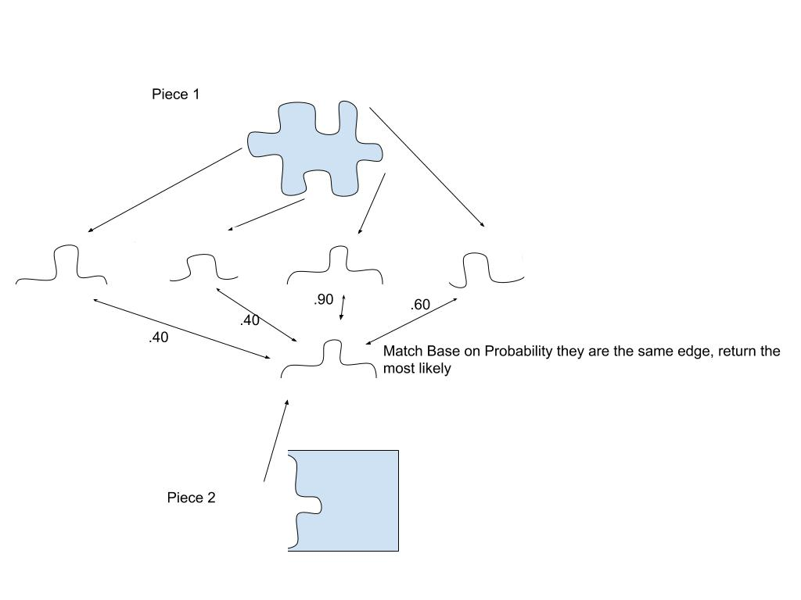

### Puzzle Processor

What we will need

- Puzzle Imaging
- Parse Image to Pick out puzzle pieces
	- Need to pick library, OpenCV?
	- Here is a list of libraries, with image ones in there:
	https://en.cppreference.com/w/cpp/links/libs
	- What do we want to program in? C++? python? John thinks it would be fun to do C++
- Put each piece as an object, probably as a vector image
	-Will have to account for the fact of resolution of the image, and should allow
	a little wiggle room in the next step
	- Important step is that all the sides must become in the same orientation somehow. 
	I think we should do it so the bump is always out
	-This way we can match them with their partner.
	-Should tell user how many puzzle pieces were detected. (could warn them if it is not a 
	normal puzzle amount)
	- Need to record
		- Piece location
		- types of edges
		- edge length

 
- Figure out which piece goes where 
	- This is going to be the hard part. I think we should parse each side of a puzzle piece as
	a side (4 per piece) and then figure out which ones are the most similar in shape.
	Each edge should match with another edge, do simialrity scoring to see if they match
	- BONUS: If we are successful with the edges, we can make our algorithm even better by 
	making it so that we add color as another factor that falls into the probability of 
	a piece fitting together
- Informing user about which puzzle piece goes where.
	- Once we solve the problem, we have to have a way of communicating it to the user
	- Could be based on location (different squares of paper)
	- Could light up which puzzle piece in the image probably fits.
	- Need way for user to provide feed back on if the piece actually was a fit. We can then go
	to the next best fit from there.
